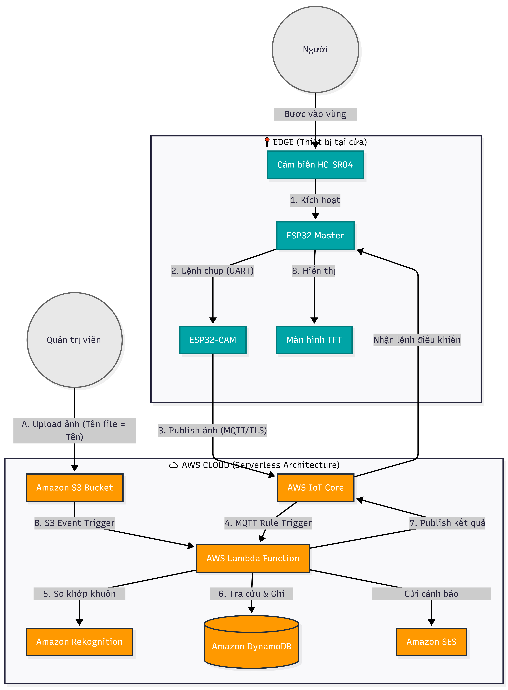

# AWS Serverless IoT Face Recognition System 🛡️

Hệ thống giám sát an ninh IoT toàn diện, kết hợp phần cứng vi điều khiển với kiến trúc đám mây không máy chủ (Serverless). Dự án giải quyết bài toán bảo mật sinh trắc học trên thiết bị giá rẻ bằng cách tích hợp thuật toán phân tích phản xạ ánh sáng đèn Flash (Active Flash Liveness), giúp ngăn chặn hiệu quả các cuộc tấn công mạo danh bằng ảnh in hoặc màn hình điện thoại.


---

## ✨ Features

* **Chống giả mạo (Anti-Spoofing):** Thuật toán Active Liveness độc quyền sử dụng đèn Flash để phân biệt da người thật và màn hình điện tử/ảnh in.
* **Nhận diện chính xác (>99%):** Tích hợp engine AI từ Amazon Rekognition cho khả năng so khớp khuôn mặt với độ trễ thấp (< 2 giây).
* **Đăng ký tự động:** Quy trình (pipeline) tự động hóa hoàn toàn; chỉ cần upload ảnh người dùng mới vào Amazon S3, hệ thống sẽ tự học và cập nhật cơ sở dữ liệu.
* **Kiến trúc Serverless tối ưu:** Không cần duy trì máy chủ chạy 24/7, tự động mở rộng (auto-scaling) và tiết kiệm chi phí vận hành.
* **Cảnh báo bảo mật:** Gửi email đính kèm ảnh chụp hiện trường ngay lập tức qua Amazon SES khi phát hiện người lạ hoặc nỗ lực giả mạo.

---

## 🛠 Tech Stack

**Phần cứng (Hardware / Edge):**
* ESP32 WROOM (Master Controller)
* ESP32-CAM AI-Thinker (Image Acquisition)
* HC-SR04 Ultrasonic Sensor
* TFT LCD Screen
* ESP-IDF

**Đám mây (AWS Cloud Backend):**
* **Compute:** AWS Lambda (Python 3.12)
* **IoT & Messaging:** AWS IoT Core (MQTT over SSL/TLS)
* **AI / ML:** Amazon Rekognition
* **Database:** Amazon DynamoDB
* **Storage:** Amazon S3
* **Notification:** Amazon SES

---

## 🏗 System Architecture

Dữ liệu được truyền tải bảo mật hai chiều từ thiết bị lên đám mây thông qua giao thức MQTT với chứng chỉ X.509.



---

## 📊 Performance Metrics

* **Độ chính xác (Accuracy):** > 99% (Thực nghiệm trên tập dữ liệu nội bộ).
* **Hiệu quả chống giả mạo:** Chặn > 95% nỗ lực truy cập bằng ảnh tĩnh và màn hình.
* **Độ trễ toàn trình (End-to-end Latency):** ~ 1.8 giây cho toàn bộ vòng lặp (Chụp -> Đám mây xử lý -> Trả kết quả mở cửa).

---

## ⚙️ Environment Variables

Để chạy dự án này trên AWS, bạn cần cấu hình các biến môi trường sau cho hàm Lambda:

`S3_BUCKET_NAME`: Tên bucket chứa ảnh gốc.
`COLLECTION_ID`: ID của bộ sưu tập khuôn mặt trên Rekognition (vd: `person`).
`SENDER_EMAIL`: Email đã được xác thực trên Amazon SES để gửi cảnh báo.

---

## 🚀 Run Locally / Deployment

### 1. Cấu hình AWS Cloud
* Khởi tạo **AWS IoT Thing** và tải về các chứng chỉ (Certificates & Private Key).
* Tạo các bảng **DynamoDB**: `facerecognition` (Partition Key: `RekognitionId`) và `AccessLogs` (Partition Key: `camera_id`, Sort Key: `timestamp`).
* Triển khai code Python từ thư mục `backend/` lên **AWS Lambda** (nhớ đính kèm Layer `Pillow` để xử lý ảnh).
* Thiết lập Rule trên IoT Core để chuyển tiếp gói tin MQTT sang hàm Lambda.

### 2. Nạp Firmware ESP32
* Tạo file `include/secrets.h` dựa trên file `.example`.
* Cập nhật thông vị WiFi và dán nội dung chứng chỉ AWS IoT Core vào file này.
```c
#define WIFI_SSID "Tên_WiFi"
#define WIFI_PASS "Mật_khẩu"

static const char AWS_CERT_CA[] PROGMEM = R"EOF( ... )EOF";
static const char AWS_CERT_CRT[] PROGMEM = R"EOF( ... )EOF";
static const char AWS_CERT_PRIVATE[] PROGMEM = R"EOF( ... )EOF";
```
## 👨‍💻 Author
    Tu Duc Hiep

    GitHub: @hi3rdt
    Email: tuduchiep123@gmail.com


